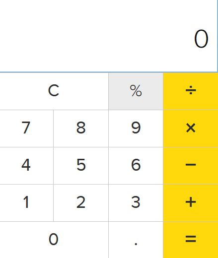

# Kalkulator

## Planlegging

Jeg tenker å lage en kalkulator som lar deg gjøre grunnleggende regning. Noe som ser omtrent ut som denne (duckduckgo sin kalkulator):

Jeg har også brukt kode som inspirasjon (fra 100jsprojects): [github sahandghavidel basic calculator](https://github.com/sahandghavidel/HTML-CSS-JavaScript-projects-for-beginners/blob/main/projects/basic-calculator/index.js)

Andre kilder: [geeksforgeeks.com](https://www.geeksforgeeks.org/css/css-variables/)

## Prosess

Jeg begynte med det enkleste først, altså html-en. Jeg la til alle knappene og ga klasser til de som trengte det. Etter html var det både js og css på omtrent samme tid. Javascripten er en nokså enkel kode som baseres på en for-løkke som henter alle knapper og kjører kode basert på tekstinnhold i knappene.

## Forbedringer

### Idéer

Koden jeg tok inspirasjon hadde alle tall-knappene (og punktum for desimal), regneartene og en C-knapp som tømmer feltet. 

##### "Backspace"

For å utvide funksjonen litt kan jeg legge til en knapp som ikke tømmer hele feltet, men bare den nyeste/siste karakteren i feltet.

##### Funksjoner og Færre Event-Listeners

Det er bedre å funksjoner som defineres utenfor for-løkka, slik at koden er lettere å opprettholde.

### Gjennomførte 

Jeg fikk lagt til "backspace"-funksjonen, og det var ganske enkelt. Det eneste jeg gjorde var å legge til enda en if-else i for-løkken som bruker slice-metoden. Den tar lengden til tekststrengen